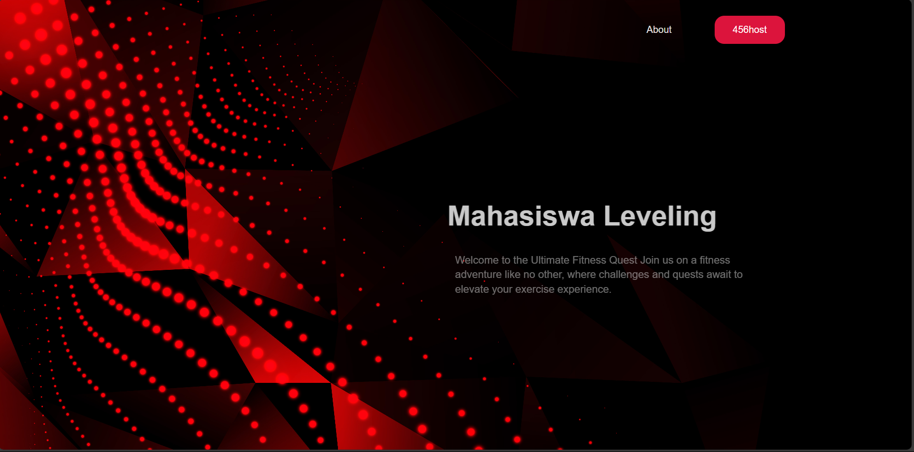
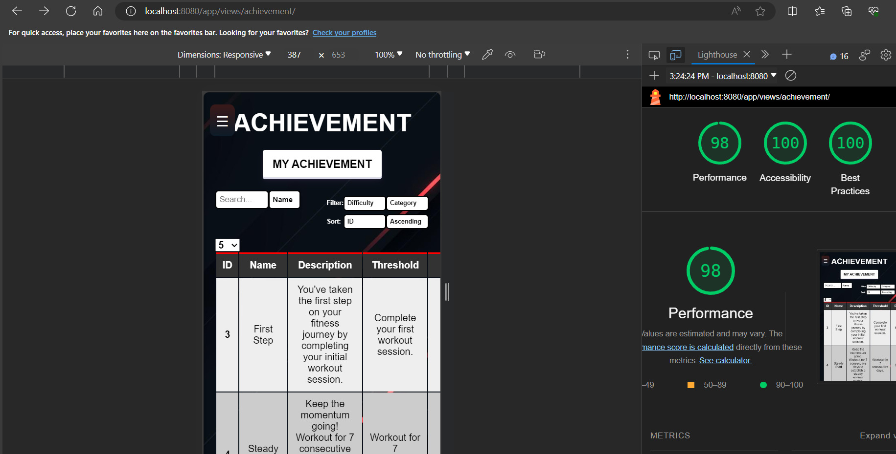
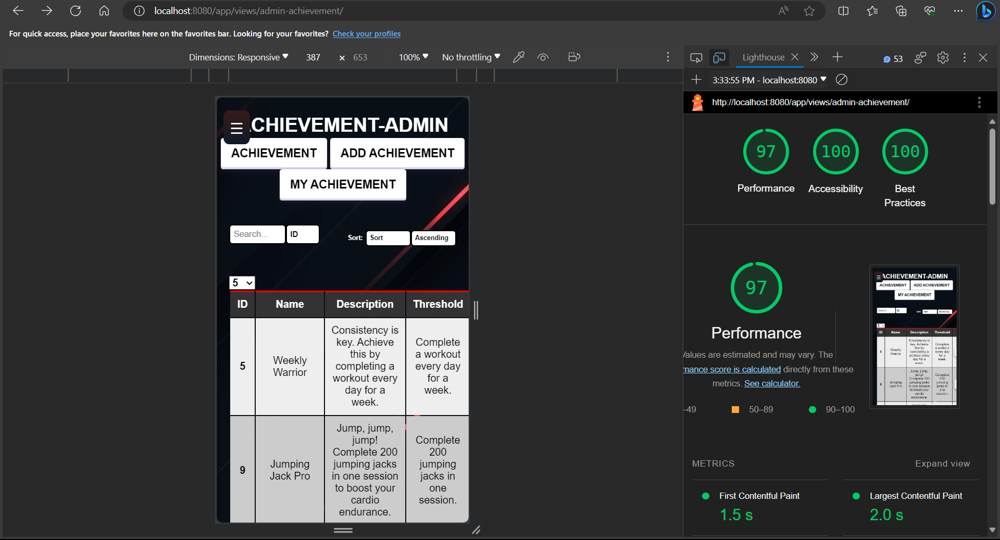
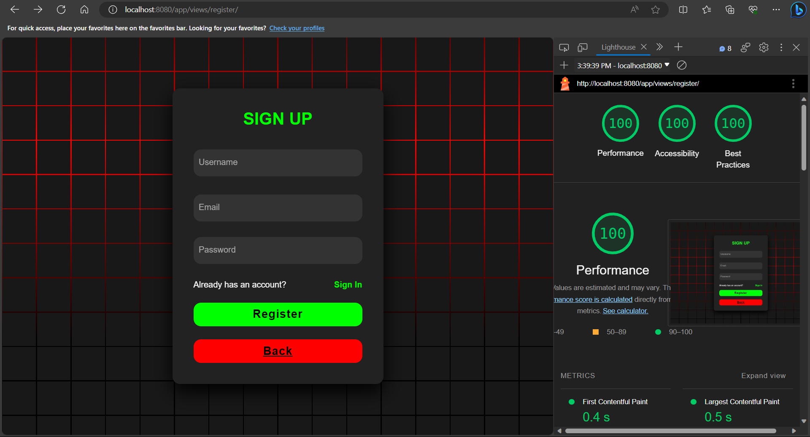

# MAHASISWA LEVELING

## Deskirpsi

Mahasiswa Leveling is a web-based application developed using pure HTML, CSS, JavaScript, and PHP, designed to assist users in their workout routines. This application provides a variety of features to enhance the user experience and motivation while pursuing their fitness goals.

## Key Features
1. **Achievement System**:
Boosts user motivation by offering a comprehensive achievement system that rewards users for reaching specific milestones during their workout journey.

2. **Leveling and Experience Points (EXP)**:
Every user is assigned a level based on their workout progress and gains experience points (EXP) for completing various fitness tasks. This gamified approach encourages users to stay committed to their fitness routines.

3. **Quests**:
Users can take on fitness quests to challenge themselves and earn rewards. These quests provide an additional layer of engagement and personalization to their workout experience.

4. **Profile Management**:
Users have the ability to view and edit their profiles, allowing them to tailor their workout journey to their preferences. They can also track the number of completed quests and achievements they have unlocked.

5. **Profile Pictures and Audio Collection**:
Users can personalize their profiles with profile pictures and store multiple audio files in their collection. This feature enables users to add a personal touch to their workout experience by listening to their favorite tunes or motivational audio.

6. **Many More**:
This application also provides other interesting features that can be explored by users.

## Requirement

This project built using:
1.  php 8.0-apache
2.  mysql latest

## Instalasi

1. Clone or download this repository
2. Install XAMPP or Docker
3. Create .env file in config folder
4. Configure .env file (example in .env.example)

## How to Run

### XAMPP

1. Move this repository to htdocs folder
2. Start Apache

### Docker

1. run this command in terminal (root directory):
```bash
docker compose --env-file config/.env build
```
2. run this command in terminal (root directory):
```bash
docker compose --env-file config/.env up
```
If there is an error about mysqli, do the following:
1. Open docker apache terminal
2. run:
```bash
docker-php-ext-install mysqli
```
3. restart docker apache

## Application Screenshots

## Mobile Version


## Desktop Version





## Lighthouse Screenshots

### Database Schema


### Achievement (User) Page Desktop


### Achievement (User) Page Mobile


### Achievement (Admin) Add Page Desktop


### Achievement (Admin) Page Desktop


### Achievement (Admin) Edit Page Desktop


### Achievement (Admin) Page Mobile


### Challenge Page Desktop


### Challenge Page Mobile


### Collection Page Desktop


### Collection Edit Page Desktop


### Collection Page Mobile


### Edit Profile Page Desktop


### Edit Profile Page Mobile


### Error Page 403 Desktop


### Error Page 403 Mobile


### Error Page 404 Desktop


### Error Page 404 Mobile


### Login Page Desktop


### Login Page Mobile


### My Achievement (User) Page Desktop


### My Achievement (User) Page Mobile


### Register Page Desktop


### Register Page Mobile


### User Profile Page Desktop


### User Profile Page Mobile


### Hall of Fame Page Desktop


### Hall of Fame Page Mobile


### Landing Page


## Team Collaboration - Task Allocation

### Frontend (Client Side)
|Feature|13521015|13521025|
|-------|--------|--------|
|Login|✔️||
|Register|✔️||
|Home||✔️|
|Error (403 & 404)|✔️||
|Achievement (User)|✔️||
|Achievement (Edit)|✔️||
|Achievement (Add)|✔️||
|My Achievement (User)|✔️||
|Challenge|✔️||
|Collection|✔️||
|Collection (Edit)|✔️||
|Edit Profile|✔️||
|User Profile|✔️||
|Hall of Fame (User)||✔️|
|Hall of Fame (Edit)||✔️|
|Hall of Fame (Add)||✔️|
|Navbar|✔️||

### Backend (Server Side)
|Feature|13521015|13521025|
|-------|--------|--------|
|Authentication (Login & Register & Logout)|✔️||
|Achievement (User)|✔️||
|Achievement (Edit)|✔️||
|Achievement (Add)|✔️||
|My Achievement (User)|✔️||
|Challenge|✔️||
|Collection|✔️||
|Collection (Edit)|✔️||
|Edit Profile|✔️||
|User Profile|✔️||
|Hall of Fame (User)||✔️|
|Hall of Fame (Edit)||✔️|
|Hall of Fame (Add)||✔️|
|Initial Project (Database Schema, Folder Structure, Docker, etc)|✔️||
